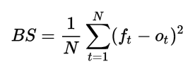
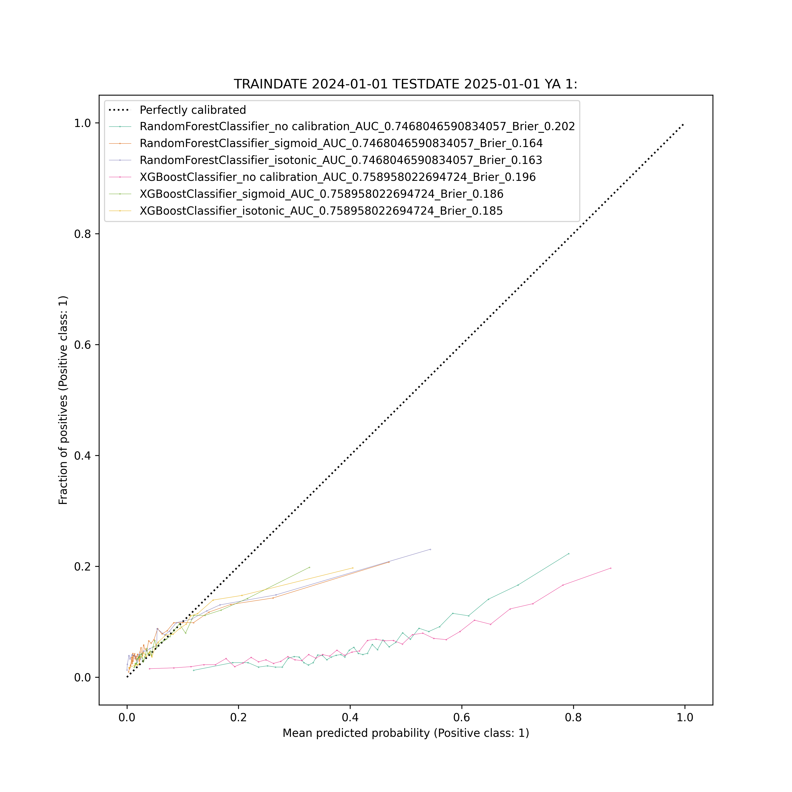
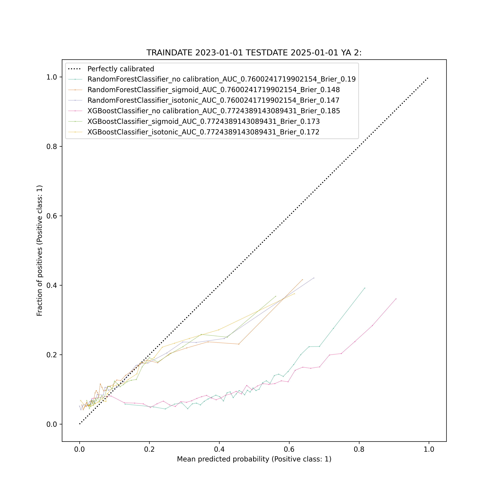
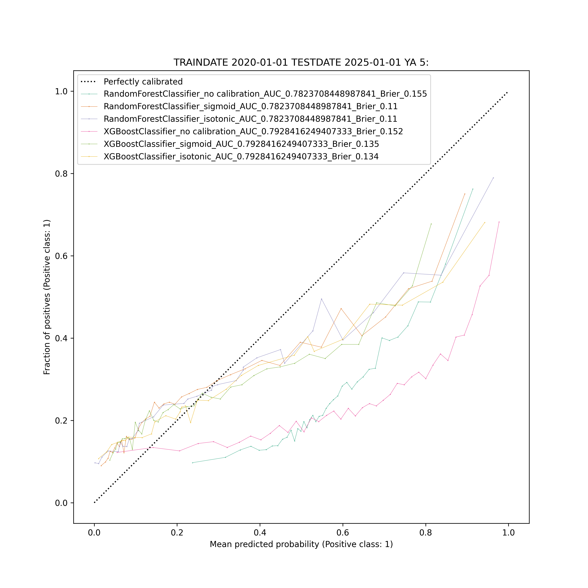

Verhuiskans is een Machine Learning model die de kans inschat dat een bewoner het huurcontract opzegt. Het model is getrained op historische verhuisdata van de Alliantie. 

**Deze repository bevat code voor:**
- Data preparatie
- Exploratory Data Analyis (EDA)
- Model training
- Model voorspellingen
- Model evaluatie
- CI/CD via Azure

# 1: Toepassingsmogelijkheden

**Een verhuiskansvoorspelling kan op vele manieren binnen de Alliantie worden gebruikt. Bijvoorbeeld:**

- Voor **wooncoaches**
    - Wooncoaches kunnen met een verhuiskans doorstroming bevorderen door bij de huurder die op het punt staat te verhuizen, barrières voor verhuizing weg te nemen.
- Voor het behalen van **prestatieafspraken**
    - Voor het halen van prestatieafspraken is het nuttig om te weten waar binnen een jaar mutaties te verwachten zijn.
- Voor de **leefbaarheid**
    - Als we weten hoeveel mutaties we kunnen verwachten in een complex, weten we i.c.m. de advieshuurprijs hoe de populatie in een complex zal veranderen. En of het waarschijnlijk is dat de leefbaarheid beter wordt, afneemt of gelijk blijft.
- Voor het begroten van **mutatielasten**
    - In combinatie met het inschatten van de kosten voor mutatieonderhoud kun je de mutatielasten mogelijk beter begroten door (kosten mutatieonderhoud x verhuiskans) te doen.
- Voor het **taxeren** van ons bezit
    - Voor de taxatieberekening moet er rekening gehouden worden met een mutatiegraad. Een verhuiskans kan hier dienstdoen als een precieze en locatie-afhankelijke mutatiegraad.


# 2: Methode

## Parametrisatie van traindate, testdate en years ahead

Om te onderzoeken of een verhuiskansmodel stabiel presteert over tijd, geven we verschillende traindates en testdates mee. Uiteindelijk brengen we alleen het verhuiskansmodel met de meest recente train/testdate naar productie, maar zo krijgen we wel een beter beeld van of het model stabiel presteert over tijd. Traindate en testdate zijn geparametriseerd om dit mogelijk te maken. 

Ook hebben we het aantal jaar dat vooruit moet worden voorspeld, geparametriseerd. Zo kun je een verhuiskans krijgen binnen 1, 2 of 5 jaar. In principe kun je hier elk aantal jaar aan toevoegen.  

## Alleen features meenemen die bekend zijn bij aanvang huurovereenkomst

Veel van de huurovereenkomsten waarop wordt getraind, zijn oud. Voor databronnen die we pas recenter ontsluiten en/of niet lang bewaren (denk aan contactmomenten, reparatieverzoeken, enz.) hebben we van de oudere huurovereenkomsten geen data. Als we dit toch zouden meenemen, kan het leiden tot bias. Daarom is besloten alleen features mee te nemen die niet veranderen over tijd (denk aan bouwjaar) en/of bekend zijn op de datum waarop de huurovereenkomst start. 

> In de toekomst kan worden nagedacht over een methodologie om datapunten mee te nemen die je alleen voor recente jaren hebt, zonder dat dat bias introduceert.  Volgens mij (Thomas) heet dit dynamic covariates. Denk bijvoorbeeld aan als er een contactmomentnotitie is geweest die gaat over “verhuizen”. Ondanks dat we hier niet alle historie van hebben, zou je denken dat hier toch voorspellende kracht in moet zitten. 

## Temporal train-test splits 

We zijn voor de verhuiskans in het bijzonder geïnteresseerd in hoe goed een verhuiskansmodel presteert op de huidige/recent actieve huurovereenkomsten. Daarom maken we geen “random” train-test splits, maar een split op basis van tijd. Waarbij de testset de meest recente datum is.

## Expand rows peildatum-based

In de kern willen we dat een verhuiskansalgoritme de relatie leert tussen huurder, eenheid, huurduur en de huurovereenkomst-status (actief/beëindigd). Om de relatie tussen huurduur, leeftijd van de woning, leeftijd van de huurder ← →  huurovereenkomst-status voor machine learning algoritmes zo duidelijk mogelijk te maken, dupliceren we één rij met één huurovereenkomst naar één huurovereenkomst op meerdere peildatums: elk jaar tussen de begindatum en einddatum van de huurovereenkomst (bijbehorende huurovereenkomst-status = actief), en elke maand in het laatste jaar van de huurovereenkomst (bijbehorende huurovereenkomst-status = beëindigd). Dit stelt het verhuiskansalgoritme in staat om een betere ranking (zie [AUC](#AUC) ) te maken tussen huurovereenkomsten die wel/niet worden opgezegd. 

We berekenen vervolgens voor elke peildatum de:
- huurduur in dagen
- leeftijd van de woning in jaren
- min/max leeftijd van de huurder(s) in jaren

De peildatum zelf wordt niet gebruikt als feature om op te trainen. 


## Machine Learning met Random Forests en XGBoost

Omdat we werken met een tabular dataset, bestaande uit relatief weinig variabelen en veel rijen (zeker nadat deze expanded zijn), denken we dat ensemble learning een goede balans is tussen goede voorspellingen die ook uitlegbaar zijn of uitlegbaar gemaakt kunnen worden. We proberen Random Forests en XGBoost uit met verschillende hyperparameters. Elk machine learning algoritme wordt met de beste hyperparameters (= beste score op AUC) doorgestuurd naar de calibratiestap (zie hierboven). We kijken in dit stadium nog niet naar de Brier Score omdat calibratie daar effect op heeft, terwijl de ranking (= AUC) bijna uitsluitend door het machine learning algoritme wordt bepaald (de meeste calibratiemethodes zijn monotonisch en veranderen de ranking niet). 

> In het verleden hebben we meerdere andere algoritmes uitgeprobeerd waarvoor het expanden van een dataset niet nodig zou zijn, omdat het onder de motorkap zou gebeuren. Deze technieken leverden onvoldoende goede resultaten op en daarom hebben we ze afgeschreven.
> - Cox Proportional Hazards: leidde tot slechte voorspellingen. Wist de relatie tussen features en huurduur niet goed te modelleren.
> - DeepSurv: survival analysis gebruik makend van deep learning. Leidde ook tot slechte voorspellingen. Bovendien is DeepSurv niet wijd gebruikt, daarom moeilijker om support en best practices te ontdekken. Tenslotte is een deep learning algoritme minder uitlegbaar.
> - Time Series algoritmes (autoregressive, moving average, ARIMA, SARIMA): Klassieke time-series hebben een target die veel verandert over de tijd heen. Bij ons blijft de target juist constant over tijd tot de event (verhuizing). Klassieke Time series forecasting is voornamelijk een regressietaak, terwijl wij op zoek zijn naar een predict_proba van een binaire voorspelling. Daarom zijn deze technieken niet geschikt en ook afgeschreven.

## Calibratie van voorspellingen

Doordat huurovereenkomsten worden gedupliceerd op verschillende peildatums (zie [Expand rows peildatum-based](#Expand-rows-peildatum-based) ) is er in de trainset een disbalans tussen beëindigde huurovereenkomsten en niet-beëindigde huurovereenkomsten (bij voorspelling 1 jaar vooruit resp. ~55% en 45%). In de testset, en dus 'in real life’, is deze verhouding heel anders (bij voorspelling 1 jaar vooruit resp. ~6% en 94%).  Als we niets doen, krijgen we te hoge kansen. Calibratie is een techniek om dit te corrigeren. 

Calibratie van voorspellingen gaat over het afstemmen van de predicted probabilities van een model op de daadwerkelijke kans op een uitkomst/event. Een goed gecalibreerd model zorgt ervoor dat, bijvoorbeeld, als het een kans van 0,2 voor een gebeurtenis voorspelt, die gebeurtenis in de praktijk ongeveer 20% van de tijd of 2 uit de 10 gevallen plaatsvindt.

Voor het verhuiskansalgoritme wordt een (expanded) trainset gebruikt met een kunstmatige verdeling tussen wel/niet beëindigde huurovereenkomsten. De laatste 1-januari peildatum van de trainset wordt uit de trainset gehaald en gebruikt als calibratieset. Omdat we de peildatum 1-januari gebruiken, is de verdeling tussen wel/niet beëindigde huurovereenkomsten zoals we dat in de praktijk (en in de testset) zien.

We evalueren de mate waarin het calibreren is gelukt door te kijken naar de brier score (cross-validated op de calibratieset), en de calibratieplot op de testset. Deze methodologie volgt grotendeels de werkwijze van een [hoorcollege](https://www.youtube.com/watch?v=w3OPq0V8fr8) van Columbia University.

Voor het verhuiskansalgoritme proberen we drie verschillende calibratietechnieken uit: **sigmoid** (Platt’s method / logistische regressie), **isotonic** (“fitting a monotonic free-form line to observations”) en **geen calibratie**. Geen calibratie betekent dat het machine learning algoritme na hyperparameter tuning niet meer wordt aangepast. 

## Survivorship bias
### Wat is survivorship bias en waardoor is het veroorzaakt?

Survivorship bias willen we voorkomen: het is namelijk zo dat hoe verder we teruggaan in de geschiedenis, hoe vaker het voorkomt dat we wél de huurovereenkomsten zien die lang hebben geduurd, en niét de huurovereenkomsten met een kortere looptijd. De huurovereenkomsten die zijn afgelopen, zijn met migraties naar nieuwe systemen niet meer meegenomen. Hierdoor kan een voorspelmodel leren dat oude/langlopende huurovereenkomsten eindeloos duren, omdat het de oude kortelopende huurovereenkomsten niet heeft gezien. Dan modelleren we niet de werkelijkheid, maar een datakwaliteitsissue (verliezen van oude data bij migraties). Dit willen we voorkomen.

### Hoe ziet survivorship bias eruit in onze data?

We kijken naar het percentage gemuteerde huurovereenkomsten, gegroepeerd per startjaar huurovereenkomst. We verwachten dat hoe verder terug in de tijd qua startjaar huurovereenkomst, hoe groter het percentage gemuteerd. Op het moment dat het percentage gemuteerd weer afneemt, komt dat doordat we de kortlopende huurovereenkomsten missen die verloren zijn gegaan bij één of meerdere migraties. Dat is het moment vanaf waar we de huurovereenkomsten niet meer willen meenemen. Zie onderstaand de analyse-uitkomsten

```python
# We pakken het DataFrame waarin vhk_alle_queries en vhk_alle_queries_AX_Backup concatenated zijn.
df_combined_path = generate_data_dir_path(LEVEL.LOAD, "df_combined", suffix=".pickle")
df = load_from_pkl(df_combined_path)
df.replace({"huurovereenkomst_statusnaam": {"Actief": 0, "Beëindigd": 1}}, inplace=True)

df1 = (
        df.groupby("startjaar_huurovereenkomst")
            .agg(
                avg_huurduur_jaren=("survival_huurduur", lambda x: np.round(x.mean()/365, 1)), 
                count=(COL_ID_HOVK, "count"),
                perc_gemuteerd=("huurovereenkomst_statusnaam", lambda x: np.round(x.mean(), 2))
      )
)
print(df1.to_string())
```

```bash
                            count  perc_gemuteerd
startjaar_huurovereenkomst                       
1922                            1            1.00
1936                            1            1.00
1940                            1            1.00
1943                            2            1.00
1949                            1            1.00
1950                            5            1.00
1951                           25            1.00
1953                           17            1.00
1954                           21            0.95
1955                            4            0.75
1956                            5            1.00
1957                            6            1.00
1958                           10            0.90
1959                           14            1.00
1960                           80            0.98
1961                           45            0.96
1962                            8            1.00
1963                           59            0.95
1964                           39            0.95
1965                           16            1.00
1966                           18            0.89
1967                           34            0.91
1968                           51            0.92
1969                           53            0.89
1970                           44            0.80
1971                         1069            0.89
1972                          352            0.80
1973                          146            0.76
1974                         1151            0.73
1975                          300            0.69
1976                          402            0.61
1977                          211            0.71
1978                          262            0.61
1979                          140            0.72
1980                          427            0.71
1981                          346            0.66
1982                          577            0.73
1983                         3148            0.73
1984                         1171            0.66
1985                         1186            0.68
1986                         1448            0.65
1987                         1263            0.71
1988                         1429            0.69
1989                         3358            0.69
1990                         1749            0.68
1991                         1911            0.71
1992                         1792            0.72
1993                         2380            0.71
1994                         2168            0.73
1995                         2875            0.75
1996                         3205            0.76
1997                         4010            0.78
1998                         4369            0.77
1999                         5420            0.81
2000                         4441            0.83
2001                         4556            0.83
2002                         4990            0.85
2003                         5545            0.84
2004                         5318            0.82
2005                         5339            0.81
2006                         5386            0.78
2007                         4618            0.78
2008                         5435            0.77
2009                         4539            0.77
2010                         4700            0.75
2011                         4249            0.74
2012                         3563            0.72
2013                         4266            0.69
2014                         3923            0.67
2015                         3898            0.62
2016                         4226            0.58
2017                         5751            0.45
2018                         4218            0.45
2019                         3672            0.34
2020                         3679            0.31
2021                         4130            0.30
2022                         4006            0.17
2023                         3991            0.08
2024                         4414            0.02
2025                           37            0.00
```

**Conclusie**: We zien bij huurovereenkomsten met een startjaar ouder dan 2002 dat het percentage gemuteerd weer afneemt. Dat vertelt ons dat de survivorship bias optreedt bij huurovereenkomsten ouder dan deze datum. 

### Hoe gaan we om met deze survivorship bias?

**We hebben twee oplossingsrichtingen onderzocht:**

1: Hoe goed werkt het algoritme als we het trainen op huurovereenkomsten die gestart zijn vanaf 2002? We verwachten dat dit model beter voorspelt voor kortdurende huurovereenkomsten, en minder goed voor (zeer) langlopende huurovereenkomsten.
- Voordeel: we hebben hiervan de volledige data (lopende én afgesloten huurovereenkomsten).
- Nadeel: we hebben in onze actieve huurovereenkomsten (de predictset) een aantal huurovereenkomsten die al voor 2002 startten. Het model weet mogelijk niet goed hoe hier een goede verhuiskans voor af te geven, omdat het hier geen voorbeelden van heeft gezien.

2: Hoe goed werkt het algoritme als we het trainen op alle huurovereenkomsten? We verwachten dat dit model beter voorspelt voor (zeer) langlopende huurovereenkomsten, en minder goed voor kortlopende huurovereenkomsten.
- Voordeel: we hebben in onze actieve huurovereenkomsten (de predictset) een aantal huurovereenkomsten die al voor 2002 startten. Dit model heeft hier meer voorbeelden van gezien.
- Nadeel: we missen oudere, kortlopende huurovereenkomsten. Het model leert mogelijk dat alle huurovereenkomsten langer duren dan in praktijk het geval is. 

Uiteindelijk is gekozen op het filter van startjaar huurovereenkomst >= 2002 te hanteren. De reden is dat in de set van actieve huurovereenkomsten in de predictset we meer kortlopende huurovereenkomsten hebben dan (zeer) langlopende huurovereenkomsten.

> Dit betekent dat het model niet getraind wordt op huurovereenkomsten die langer dan ~23 jaar lopen. Terwijl we in de praktijk wel huurovereenkomsten hebben met een langere huurduur. In de resultaten moeten we scherp oog hebben voor hoe goed de verhuiskans is voor deze groep huurovereenkomsten. Het kan zijn dat we een (lichte) omgekeerde survivorship bias hebben doordat het algoritme niet goed weet hoe het moet omgaan met (zeer) langlopende huurovereenkomsten.

# Data

Per jaar worden er ongeveer 3.000 huurovereenkomsten opgezegd. Na migratie in mei 2023 staat er in de nieuwe applicatie nog maar ±5 jaar historie. Dat betekent (begin 2026) ca. 24.000 verhuizingen waar het model van kan leren. Dat is weinig en daarom halen we ook historie uit de Tobias AX backup. 

## Normalisatie, one-hot encoding en missing value handling
Numerieke waarden normaliseren we en categorische variabelen worden one-hot-encoded, waarbij maximaal 10 categorieën worden meegenomen en de meest voorkomende categorie niet als variabele meekomt om multicollineariteit tegen te gaan (zie [referentie](https://github.com/scikit-learn/scikit-learn/issues/23436)). 

Missende waarden worden op de volgende manier geimpute:

- **Categorisch**: meest voorkomende waarde.
- **Numeriek**: de mediaan. 


# Evaluatiemetrics
Voor de meeste toepassingen van het verhuiskansmodel is het belangrijk dat het model kan rangschikken en dat het kansen calibreert. Daarom kijken we naar onderstaande metrics.

- Kan het model eenheden/huurovereenkomsten rangschikken van hoge kans (verhuist vrijwel zeker) naar lage kans (verhuist vrijwel zeker niet)?
    - Wordt uitgedrukt in de **Area Under the ROC Curve (AUC)**
- Zijn de voorspellingen goed gecalibreerd? Dat wil zeggen dat eenheden/huurovereenkomsten die verhuisd zijn een kans van 1.0 krijgen, en bij geen verhuizing 0.0.
    - Wordt uitgedrukt in de **Brier Score** en in **Calibration plots**

> De kansen kunnen indien nodig nog geschaald worden naar een voor de business logisch aantal. Bijvoorbeeld als de som van verhuiskansen overeen moet komen met het totaal aantal mutaties per jaar.

## AUC
We kiezen voor AUC omdat het bij uitstek geschikt is om te meten in welke mate een model positieven (1) van negatieven (0) kan rangschikken

> We hebben eerder overwogen om rangschikking te meten met de concordance-index (C-index), omdat deze in geval van survivalanalyses van nature rekening houdt met censoring (zie voor uitleg: [Harrels's C-index](https://statisticaloddsandends.wordpress.com/2019/10/26/what-is-harrells-c-index/)). Maar, wij vonden de C-index te streng: hij kijkt bijv. ook naar paren die beiden in hetzelfde jaar enkele dagen na elkaar zijn verhuisd, en of de ene die enkele dagen eerder was een hogere risk-score had dan de ander. Dit is voor onze toepassingen niet belangrijk - als het model beide als verhuizing binnen één jaar weet te voorspellen is dat voldoende. Dit is precies wat de AUC doet en vandaar onze keuze. 

## Brier Score
ls we alleen zouden kijken naar rangschikking d.m.v. de Concordance-index, kan het model theoretisch gezien een perfecte score behalen door alle verhuiskansen tussen 0.49 - 0.51 te plaatsen. Om ervoor te zorgen dat de verhuiskansen beter gecalibreerd zijn (als Y=1, dan P(Y)≈1.0 | als Y=0, dan P(Y)≈0.0), kijken we ook naar de Brier Score. De Brier-score is de Mean Squared Difference tussen de True Class en de Predicted Probability.



Het neemt een waarde aan tussen 0 en 1: het kwadraat van het grootst mogelijke verschil tussen de True Class en Predicted Probability. Hoe lager de Brier Score is, hoe beter de voorspellingen zijn gecalibreerd. De Brier Score neemt een waarde aan tussen nul en één, aangezien dit het kwadraat is van het grootste mogelijke verschil tussen een voorspelde waarschijnlijkheid en de werkelijke uitkomst. Hoe lager de score, hoe beter.

## Calibration Plots

AUC en Brier Score vangen niet alle informatie die je wil hebben om te beoordelen welk model de beste calibratie heeft. Daarom kijken we bij het kiezen naar een model ook handmatig naar de calibratieplots. Calibratieplots vergelijken hoe goed de probabilistische voorspellingen van een binaire classifier gecalibreerd zijn. De voorspellingen worden in bins verdeeld, zodat de x-as de gemiddelde predicted probability in elke bin weergeeft. De y-as geeft vervolgens de fractie positieven aan op basis van de voorspellingen in die bin, oftewel het aandeel van de voorbeelden waarvan de klasse de positieve klasse is (in elke bin).

In deze visualisatie kun je zien hoe goed verschillende algoritmes gecalibreerd zijn ten opzichte van de horizontale lijn die staat voor een “Perfectly calibrated model”. Hieronder zie je een paar voorbeelden van zo’n calibration plot. 








# Local development
**1:  Maak een conda environment aan en installeer de dependencies:**
```bash
conda create -n verhuiskans python=3.10 -y && conda activate verhuiskans
pip install -r requirements.txt
pip install -e .
```

**2: Installeer pre-commit**

```bash
pre-commit install
```

**3:  Gebruik:**

- Voor trainen, voer `src/main_train.py` uit.

- Voor voorspellen (met het getrainde model) voer `src/main_predict.py`


